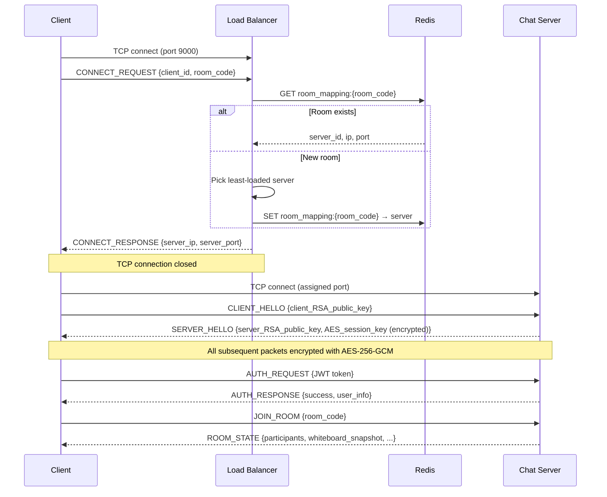
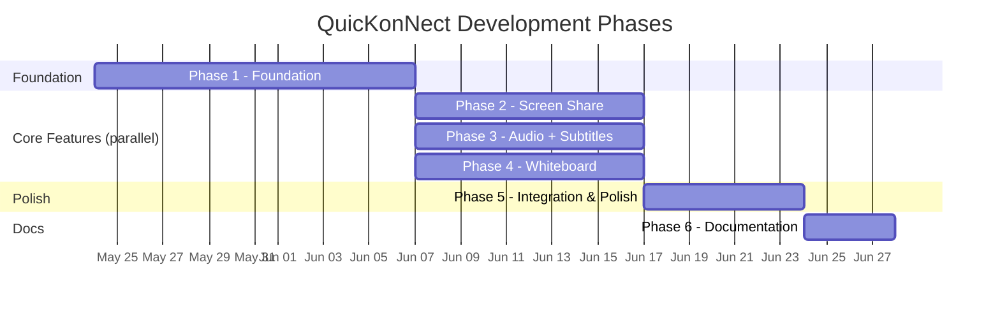

# ARCHITECTURE.md — QuicKonNect System Architecture

> **Status:** Planning — no code yet.
> **Last updated:** 2026-05-23

---

## Table of Contents

1. [Design Decisions & Assumptions](#1-design-decisions--assumptions)
2. [Overall System Design](#2-overall-system-design)
3. [Technology Stack](#3-technology-stack)
4. [Component Breakdown](#4-component-breakdown)
5. [Data Flow](#5-data-flow)
6. [Binary Protocol Specification](#6-binary-protocol-specification)
7. [Database Schema (PostgreSQL)](#7-database-schema-postgresql)
8. [Cryptography Architecture](#8-cryptography-architecture)
9. [Project Structure](#9-project-structure)
10. [UI/UX Design Notes](#10-uiux-design-notes)
11. [Key Trade-offs](#11-key-trade-offs)
12. [Phased Development Plan](#12-phased-development-plan)

---

## 1. Design Decisions & Assumptions

These decisions resolve ambiguities and contradictions found during requirements review.

| # | Issue | Decision | Rationale |
|---|-------|----------|-----------|
| 1 | E2E encryption conflicts with server-side audio mixing and whiteboard event processing | Use **transport-level encryption** (client↔server) for audio, video, and whiteboard. True E2E only for text messages. | The server must decrypt audio to mix it and must read whiteboard events to assign sequence numbers. True E2E is impossible for data the server needs to process. |
| 2 | No webcam video feature defined despite "video calling" label | The "video call" is the **room** where participants share screens and hear audio. No separate webcam stream. | None of the three graded features covers webcam capture. Adding it would increase scope without scoring benefit. Can be added later if needed. |
| 3 | Load balancer could split same-room users across servers | Make the load balancer **room-aware**: first joiner picks the server; subsequent joiners for the same room follow. | Relaying real-time media between servers via Redis would add 50-100ms+ latency and massive complexity. Room-pinning is the standard approach. |
| 4 | "Desktop/web" mentioned but tech stack is desktop-only | Build a **desktop-only** client using PyQt6. | Raw TCP sockets from a browser require a WebSocket bridge layer. Desktop aligns with the course's TCP socket emphasis. |
| 5 | MySQL syntax in schema | Adapt to **PostgreSQL** syntax throughout. | User requirement. |
| 6 | Audio mixer broadcasts to ALL including sender | Mixer sends each client a mix of **everyone else**, excluding their own stream. | Sending users their own audio back causes echo and doubles bandwidth. |

---

## 2. Overall System Design

```
┌─────────────────────────────────────────────────────────────────┐
│                          CLIENTS (PyQt6)                        │
│                                                                 │
│  ┌──────────┐  ┌──────────┐  ┌──────────┐  ┌──────────┐       │
│  │ Client A │  │ Client B │  │ Client C │  │ Client D │       │
│  └────┬─────┘  └────┬─────┘  └────┬─────┘  └────┬─────┘       │
└───────┼──────────────┼──────────────┼──────────────┼────────────┘
        │    TCP       │              │              │
        ▼              ▼              ▼              ▼
┌─────────────────────────────────────────────────────────────────┐
│                     LOAD BALANCER (Port 9000)                   │
│                                                                 │
│  • Accepts initial TCP connections from clients                 │
│  • Maintains room→server mapping in Redis                       │
│  • For new rooms: picks least-loaded server                     │
│  • For existing rooms: returns the server already hosting it    │
│  • Responds with assigned server IP:Port, then closes           │
│  • Periodic health checks to all chat servers                   │
└────────────┬───────────────────────────┬────────────────────────┘
             │  Internal TCP             │
             ▼                           ▼
┌──────────────────────┐   ┌──────────────────────┐
│   CHAT SERVER 1      │   │   CHAT SERVER 2      │
│   Port: 9001         │   │   Port: 9002         │
│                      │   │                      │
│  • Thread per client │   │  • Thread per client │
│  • Audio mixing      │   │  • Audio mixing      │
│  • Screen relay      │   │  • Screen relay      │
│  • Whiteboard sync   │   │  • Whiteboard sync   │
│  • Messaging         │   │  • Messaging         │
│  • Auth validation   │   │  • Auth validation   │
└──────────┬───────────┘   └──────────┬───────────┘
           │                          │
           └────────────┬─────────────┘
                        │
          ┌─────────────┼─────────────┐
          ▼                           ▼
┌──────────────────┐     ┌──────────────────────┐
│      Redis       │     │    PostgreSQL         │
│                  │     │                       │
│  • Room→server   │     │  • User accounts      │
│    mapping       │     │  • Friend lists       │
│  • Online users  │     │  • Message history    │
│  • Session state │     │  • Room metadata      │
│  • Pub/sub for   │     │  • Whiteboard events  │
│    cross-server  │     │  • Session tokens     │
│    notifications │     │                       │
└──────────────────┘     └──────────────────────┘
```

### Key Architectural Principles

- **Room-pinned load balancing:** All clients in the same room connect to the same chat server. No cross-server media relay needed.
- **Thread-per-client:** Each client connection gets a dedicated receiver thread. Separate threads handle mixing, broadcasting, and STT per room.
- **Server as source of truth:** For whiteboard ordering and room state, the server's sequence numbers are canonical.
- **Shared-nothing servers:** Each chat server operates independently. Redis is used only for coordination metadata (room mapping, online status), not for media relay.
- **Binary protocol over TCP:** All communication uses a custom binary protocol with a common header, enabling efficient parsing and clear packet type routing.

---

## 3. Technology Stack

| Layer | Technology | Justification |
|-------|-----------|---------------|
| **Client UI** | Python 3.11+ / PyQt6 | Native desktop framework with good TCP socket integration. Rich widget library for video display, canvas drawing, and chat UI. |
| **Chat Server** | Python 3.11+ / `socket` + `threading` | Raw TCP sockets satisfy the course requirement. `threading` module for thread-per-client model. Python matches client language — shared protocol code. |
| **Load Balancer** | Python 3.11+ / `socket` + `threading` | Simple TCP server. Same language keeps the codebase uniform. |
| **Database** | PostgreSQL 15+ | Robust, open-source RDBMS. Native JSON support for whiteboard event payloads. Strong typing and constraint system. |
| **Cache / Sync** | Redis 7+ | In-memory store for session state, room→server mapping, and pub/sub for cross-server online status notifications. |
| **Audio Capture** | PyAudio | Python binding to PortAudio. Captures raw PCM from microphone. |
| **Audio Codec** | Opus (via `opuslib`) | Low-latency codec designed for real-time audio. Compresses 20ms PCM frames efficiently. |
| **Screen Capture** | `mss` | Fast cross-platform screen capture library. Returns raw pixels, which we compress to JPEG. |
| **Image Compression** | Pillow (`PIL`) | JPEG encoding for screen frames. Adjustable quality for bandwidth control. |
| **Remote Control** | `pyautogui` | Cross-platform mouse/keyboard automation. Simulates input events received from remote viewers. |
| **Speech-to-Text** | OpenAI Whisper (local, `faster-whisper`) | Runs locally — no API costs, works on LAN without internet. `faster-whisper` uses CTranslate2 for 4x speedup over standard Whisper. |
| **Translation** | LibreTranslate (self-hosted) | Free, self-hosted translation. No API key needed. Runs as a local Docker container or pip install. |
| **Whiteboard Canvas** | PyQt6 `QGraphicsScene` / `QPainter` | Built-in Qt drawing framework. Supports vector shapes, strokes, text. No extra dependency. |
| **Cryptography** | `cryptography` (Python package) | Well-maintained, audited library. Provides AES-256-GCM, RSA-2048, HMAC-SHA256, BCrypt. |
| **DB Driver** | `psycopg` (v3) | Modern async-capable PostgreSQL driver for Python. |
| **Redis Driver** | `redis-py` | Standard Python Redis client with pub/sub support. |
| **Tunneling** | Ngrok | Exposes local TCP port to internet for remote demo. Free tier sufficient. |

---

## 4. Component Breakdown

### 4.1 Client Application (PyQt6)

The client is a single PyQt6 desktop application with these modules:

```
┌───────────────────────────────────────────────┐
│                CLIENT APPLICATION              │
│                                               │
│  ┌─────────────┐  ┌────────────────────────┐  │
│  │  Auth UI     │  │  Connection Manager    │  │
│  │  (Login/     │  │  (TCP socket pool,     │  │
│  │   Register)  │  │   reconnection,        │  │
│  │             │  │   encryption layer)    │  │
│  └─────────────┘  └────────────────────────┘  │
│                                               │
│  ┌─────────────┐  ┌────────────────────────┐  │
│  │  Chat UI     │  │  Call Room UI          │  │
│  │  (Messages,  │  │  (Screen view,         │  │
│  │   friends,   │  │   audio controls,      │  │
│  │   contacts)  │  │   whiteboard,          │  │
│  │             │  │   subtitles)           │  │
│  └─────────────┘  └────────────────────────┘  │
│                                               │
│  ┌──────────────────────────────────────────┐  │
│  │  Media Engines (background threads)      │  │
│  │  • AudioEngine  — mic capture, playback  │  │
│  │  • ScreenEngine — capture, display       │  │
│  │  • WhiteboardEngine — draw event sync    │  │
│  │  • RemoteControlEngine — input relay     │  │
│  └──────────────────────────────────────────┘  │
└───────────────────────────────────────────────┘
```

**Connection Manager** is the single TCP connection handler. All communication goes through it. It:
- Manages the encrypted TCP connection to the assigned chat server
- Performs the RSA key exchange on connect
- Encrypts/decrypts all packets with the session AES key
- Routes incoming packets to the correct module by packet type
- Handles reconnection on disconnect

### 4.2 Chat Server

```
┌───────────────────────────────────────────────────────┐
│                    CHAT SERVER                         │
│                                                       │
│  ┌──────────────────┐  ┌──────────────────────────┐  │
│  │  Acceptor Thread  │  │  Health Reporter Thread  │  │
│  │  (listens for     │  │  (responds to LB health  │  │
│  │   new TCP conns)  │  │   queries)               │  │
│  └────────┬─────────┘  └──────────────────────────┘  │
│           │ spawns                                    │
│           ▼                                          │
│  ┌──────────────────┐                                │
│  │  Client Handler  │ ← one per connected client     │
│  │  Thread          │                                │
│  │  • RSA handshake │                                │
│  │  • Auth validate │                                │
│  │  • Packet router │                                │
│  └──────────────────┘                                │
│                                                      │
│  ┌──────────────────────────────────────────────┐    │
│  │  Room Manager (per active room)               │    │
│  │                                              │    │
│  │  ┌──────────────┐  ┌──────────────────────┐  │    │
│  │  │ Audio Mixer  │  │ Screen Broadcaster   │  │    │
│  │  │ Thread       │  │ Thread               │  │    │
│  │  └──────────────┘  └──────────────────────┘  │    │
│  │                                              │    │
│  │  ┌──────────────┐  ┌──────────────────────┐  │    │
│  │  │ Whiteboard   │  │ STT Worker Pool      │  │    │
│  │  │ Manager      │  │ (1 per speaker)      │  │    │
│  │  └──────────────┘  └──────────────────────┘  │    │
│  │                                              │    │
│  │  ┌──────────────┐                            │    │
│  │  │ Subtitle     │                            │    │
│  │  │ Broadcaster  │                            │    │
│  │  └──────────────┘                            │    │
│  └──────────────────────────────────────────────┘    │
│                                                      │
│  ┌──────────────────────────────────────────────┐    │
│  │  Shared Services                              │    │
│  │  • AuthService  (DB queries, JWT validation)  │    │
│  │  • MessageService (store/retrieve messages)   │    │
│  │  • FriendService (friend list, online status) │    │
│  │  • DBPool (psycopg connection pool)           │    │
│  │  • RedisClient (session state, pub/sub)       │    │
│  └──────────────────────────────────────────────┘    │
└───────────────────────────────────────────────────────┘
```

**Thread model per room:**
- 1 audio mixer thread (runs at fixed 20ms tick)
- 1 screen broadcaster thread (relays frames from sharer to viewers)
- 1 whiteboard manager (processes draw events, assigns seq numbers, broadcasts)
- N STT worker threads (1 per active speaker, from a thread pool)
- 1 subtitle broadcaster thread

### 4.3 Load Balancer

A lightweight TCP server with three responsibilities:

1. **Client routing:** Accept client TCP connections, look up room→server mapping in Redis (or pick least-loaded server for new rooms), respond with server address, close connection.
2. **Health monitoring:** Periodically query all registered chat servers for connection count and health status.
3. **Failover:** Mark unreachable servers as DOWN and exclude them from routing.

```
┌──────────────────────────────────────────┐
│             LOAD BALANCER                 │
│                                          │
│  ┌────────────────┐  ┌───────────────┐   │
│  │ Client Acceptor│  │ Health Check  │   │
│  │ Thread         │  │ Thread        │   │
│  │ (port 9000)    │  │ (every 5s)    │   │
│  └────────────────┘  └───────────────┘   │
│                                          │
│  ┌────────────────────────────────────┐   │
│  │ Server Registry (in-memory)       │   │
│  │ {server_id → (ip, port, status,   │   │
│  │               conn_count, cpu)}   │   │
│  └────────────────────────────────────┘   │
│                                          │
│  ┌────────────────────────────────────┐   │
│  │ Redis Client                      │   │
│  │ (room→server mapping read/write)  │   │
│  └────────────────────────────────────┘   │
└──────────────────────────────────────────┘
```

---

## 5. Data Flow

### 5.1 Client Connection Flow



### 5.2 Audio Flow (In-Room)

```
Client A (mic)                 Server (Room)                Client B (speaker)
     │                              │                              │
     │  AUDIO_CHUNK (encrypted)     │                              │
     │─────────────────────────────>│                              │
     │                              │  Decrypt                     │
     │                              │  Place in A's jitter buffer  │
     │                              │                              │
     │                              │  [Mixer thread @ 20ms tick]  │
     │                              │  Pull chunk from each buffer │
     │                              │  Mix all except recipient    │
     │                              │  Encrypt per-client          │
     │                              │                              │
     │   MIXED_AUDIO (A excluded)   │  MIXED_AUDIO (B excluded)   │
     │<─────────────────────────────│─────────────────────────────>│
     │                              │                              │
     │                              │  [STT thread]                │
     │                              │  Buffer 2-3s of A's audio   │
     │                              │  → Whisper → transcript     │
     │                              │  → (optional) translate     │
     │                              │                              │
     │      SUBTITLE packet         │      SUBTITLE packet         │
     │<─────────────────────────────│─────────────────────────────>│
```

### 5.3 Screen Sharing Flow

```
Host (sharer)                  Server (Room)                Viewer
     │                              │                         │
     │  SCREEN_FRAME (JPEG bytes)   │                         │
     │─────────────────────────────>│                         │
     │                              │  Queue frame            │
     │                              │  Broadcast to viewers   │
     │                              │─────────────────────────>│
     │                              │                         │  Display frame
     │                              │                         │
     │                              │  REMOTE_EVENT           │
     │       REMOTE_EVENT           │<────────────────────────│
     │<─────────────────────────────│  (if permitted)         │
     │  Execute (pyautogui)         │                         │
```

### 5.4 Whiteboard Flow

```
Client A (draws)               Server (Room)                Client B (viewer)
     │                              │                              │
     │  DRAW_EVENT {client_seq=1}   │                              │
     │─────────────────────────────>│                              │
     │                              │  Assign server_seq=42        │
     │                              │  Persist to DB               │
     │                              │  Broadcast to others         │
     │                              │─────────────────────────────>│
     │                              │                              │  Render event
     │  ACK {server_seq=42}         │                              │
     │<─────────────────────────────│                              │
     │  Reconcile local state       │                              │
```

---

## 6. Binary Protocol Specification

All TCP communication uses a common **packet envelope**:

```
┌─────────────────────────────────────────────────┐
│  PACKET ENVELOPE                                 │
│                                                 │
│  Bytes 0-3:   Magic number     (0x514B4E54)     │  ← "QKNT" in ASCII
│  Bytes 4-5:   Protocol version (0x0001)         │
│  Bytes 6-7:   Packet type      (uint16)         │
│  Bytes 8-11:  Payload length   (uint32)         │
│  Bytes 12-23: Nonce/IV         (12 bytes, AES-GCM) │
│  Bytes 24-39: Auth tag         (16 bytes, AES-GCM) │
│  Bytes 40+:   Encrypted payload (N bytes)       │
│                                                 │
│  Total header: 40 bytes fixed + variable payload │
└─────────────────────────────────────────────────┘
```

**Before encryption is established** (during handshake), the nonce, auth tag, and payload are sent in plaintext (packet types 0x0001 and 0x0002 only).

### Packet Types

| Code | Name | Direction | Description |
|------|------|-----------|-------------|
| `0x0001` | `CLIENT_HELLO` | C→S | RSA public key for key exchange |
| `0x0002` | `SERVER_HELLO` | S→C | RSA public key + encrypted AES session key |
| `0x0010` | `AUTH_REQUEST` | C→S | JWT token for authentication |
| `0x0011` | `AUTH_RESPONSE` | S→C | Auth result + user info |
| `0x0012` | `REGISTER_REQUEST` | C→S | Username + hashed password |
| `0x0013` | `REGISTER_RESPONSE` | S→C | Registration result |
| `0x0020` | `JOIN_ROOM` | C→S | Room code to join |
| `0x0021` | `ROOM_STATE` | S→C | Current room state (participants, whiteboard snapshot) |
| `0x0022` | `LEAVE_ROOM` | C→S | Leave current room |
| `0x0023` | `ROOM_UPDATE` | S→C | Participant joined/left notification |
| `0x0030` | `CHAT_MESSAGE` | C→S / S→C | Text/image/file message (E2E encrypted payload) |
| `0x0031` | `MESSAGE_HISTORY` | S→C | Batch of past messages |
| `0x0040` | `AUDIO_CHUNK` | C→S | Raw or Opus-encoded audio from mic |
| `0x0041` | `MIXED_AUDIO` | S→C | Server-mixed audio for playback |
| `0x0042` | `SUBTITLE` | S→C | STT transcript + optional translation |
| `0x0050` | `SCREEN_FRAME` | C→S | Compressed screen capture frame |
| `0x0051` | `SCREEN_RELAY` | S→C | Relayed screen frame to viewers |
| `0x0052` | `SCREEN_START` | C→S | Begin screen sharing |
| `0x0053` | `SCREEN_STOP` | C→S | Stop screen sharing |
| `0x0060` | `REMOTE_EVENT` | C→S / S→C | Mouse/keyboard event for remote control |
| `0x0061` | `REMOTE_REQUEST` | C→S | Request remote control permission |
| `0x0062` | `REMOTE_GRANT` | C→S | Grant/deny remote control |
| `0x0070` | `DRAW_EVENT` | C→S | Whiteboard draw event |
| `0x0071` | `DRAW_BROADCAST` | S→C | Relayed draw event with server seq |
| `0x0072` | `DRAW_ACK` | S→C | Acknowledgment with server seq |
| `0x0073` | `WHITEBOARD_SYNC` | S→C | Full whiteboard state for new joiners |
| `0x0074` | `EXPORT_REQUEST` | C→S | Request whiteboard export as PNG |
| `0x0075` | `FILE_TRANSFER` | S→C | Exported file bytes |
| `0x0080` | `FRIEND_REQUEST` | C→S | Send friend request |
| `0x0081` | `FRIEND_RESPONSE` | C→S | Accept/reject friend request |
| `0x0082` | `FRIEND_LIST` | S→C | Full friend list with online status |
| `0x0083` | `FRIEND_UPDATE` | S→C | Single friend status change |
| `0x00F0` | `CONNECT_REQUEST` | C→LB | Initial LB routing request |
| `0x00F1` | `CONNECT_RESPONSE` | LB→C | Assigned server address |
| `0x00F2` | `HEALTH_QUERY` | LB→S | Health check request |
| `0x00F3` | `HEALTH_RESPONSE` | S→LB | Connection count + CPU load |
| `0x00FF` | `ERROR` | S→C | Error message |
| `0x00FE` | `HEARTBEAT` | Both | Keep-alive ping/pong |

---

## 7. Database Schema (PostgreSQL)

```sql
-- Custom enum types
CREATE TYPE friend_status AS ENUM ('pending', 'accepted');
CREATE TYPE message_type AS ENUM ('text', 'image', 'file');

-- Users
CREATE TABLE users (
    id            SERIAL PRIMARY KEY,
    username      VARCHAR(50) UNIQUE NOT NULL,
    password_hash VARCHAR(255) NOT NULL,  -- BCrypt (cost=12)
    created_at    TIMESTAMPTZ DEFAULT NOW()
);

-- Sessions (JWT tracking / revocation)
CREATE TABLE sessions (
    id            SERIAL PRIMARY KEY,
    user_id       INT NOT NULL REFERENCES users(id) ON DELETE CASCADE,
    token         VARCHAR(512) NOT NULL,
    expires_at    TIMESTAMPTZ NOT NULL,
    created_at    TIMESTAMPTZ DEFAULT NOW()
);
CREATE INDEX idx_sessions_user_id ON sessions(user_id);
CREATE INDEX idx_sessions_token ON sessions(token);

-- Friendships
CREATE TABLE friendships (
    user_id       INT NOT NULL REFERENCES users(id) ON DELETE CASCADE,
    friend_id     INT NOT NULL REFERENCES users(id) ON DELETE CASCADE,
    status        friend_status NOT NULL DEFAULT 'pending',
    created_at    TIMESTAMPTZ DEFAULT NOW(),
    PRIMARY KEY (user_id, friend_id)
);

-- Rooms (video call / chat rooms)
CREATE TABLE rooms (
    id            SERIAL PRIMARY KEY,
    room_code     VARCHAR(20) UNIQUE NOT NULL,
    created_by    INT NOT NULL REFERENCES users(id),
    created_at    TIMESTAMPTZ DEFAULT NOW()
);

-- Room participants (for tracking who is/was in a room)
CREATE TABLE room_participants (
    room_id       INT NOT NULL REFERENCES rooms(id) ON DELETE CASCADE,
    user_id       INT NOT NULL REFERENCES users(id) ON DELETE CASCADE,
    joined_at     TIMESTAMPTZ DEFAULT NOW(),
    left_at       TIMESTAMPTZ,
    PRIMARY KEY (room_id, user_id, joined_at)
);

-- Messages
CREATE TABLE messages (
    id            BIGSERIAL PRIMARY KEY,
    room_id       INT NOT NULL REFERENCES rooms(id) ON DELETE CASCADE,
    sender_id     INT NOT NULL REFERENCES users(id),
    content       TEXT NOT NULL,              -- E2E encrypted ciphertext (base64)
    msg_type      message_type NOT NULL DEFAULT 'text',
    sent_at       TIMESTAMPTZ DEFAULT NOW()
);
CREATE INDEX idx_messages_room_id ON messages(room_id, sent_at);

-- Whiteboard events (for persistence and late-joiner sync)
CREATE TABLE whiteboard_events (
    id            BIGSERIAL PRIMARY KEY,
    room_id       INT NOT NULL REFERENCES rooms(id) ON DELETE CASCADE,
    user_id       INT NOT NULL REFERENCES users(id),
    seq_num       INT NOT NULL,
    event_type    VARCHAR(30) NOT NULL,
    payload       JSONB NOT NULL,
    created_at    TIMESTAMPTZ DEFAULT NOW()
);
CREATE INDEX idx_whiteboard_room_seq ON whiteboard_events(room_id, seq_num);
```

### Changes from RESEARCH.md schema:
- `AUTO_INCREMENT` → `SERIAL` / `BIGSERIAL`
- `ENUM(...)` inline → `CREATE TYPE ... AS ENUM`
- `TIMESTAMP` → `TIMESTAMPTZ` (timezone-aware, avoids ambiguity)
- Added `ON DELETE CASCADE` for referential integrity
- Added `room_participants` table (not in original — needed to track who is in a room)
- Added indexes on frequently queried columns
- Used `JSONB` instead of `JSON` for whiteboard payloads (indexable, more efficient)

---

## 8. Cryptography Architecture

### Layer 1: Transport Encryption (Client ↔ Server)

Every TCP connection is encrypted after the initial handshake.

```
Step 1: Client generates RSA-2048 key pair (ephemeral, per-connection)
Step 2: Client sends CLIENT_HELLO with its RSA public key (plaintext)
Step 3: Server generates:
        - Its own RSA-2048 key pair (ephemeral)
        - A random AES-256 session key (32 bytes)
Step 4: Server sends SERVER_HELLO with:
        - Server RSA public key (plaintext)
        - AES session key encrypted with client's RSA public key
Step 5: Client decrypts AES session key using its RSA private key
Step 6: All subsequent packets encrypted with AES-256-GCM
        - 12-byte random nonce per packet (included in header)
        - 16-byte auth tag per packet (included in header)
```

### Layer 2: Message-Level E2E Encryption (for text messages only)

Text messages are encrypted before leaving the sender and can only be decrypted by the recipient. The server stores ciphertext.

```
- Each user has a long-term RSA-2048 key pair (generated on first registration, stored locally)
- When two users start a private chat:
  1. They exchange RSA public keys via the server
  2. Sender generates a per-message AES-256 key
  3. Message encrypted with AES-256-GCM
  4. AES key encrypted with recipient's RSA public key
  5. Both ciphertext + encrypted key sent as the message
  6. Recipient decrypts AES key with their RSA private key, then decrypts message
```

### Layer 3: Password Storage

- BCrypt with cost factor 12
- Hashing done server-side (client sends password over the already-encrypted transport layer)

### Layer 4: JWT Tokens

- Signed with HMAC-SHA256 using a server-side secret
- Contains: user_id, username, issued_at, expires_at
- Expiry: 24 hours
- Stored on client disk for session persistence across restarts

---

## 9. Project Structure

```
QuicKonNect/
├── ARCHITECTURE.md
├── RESEARCH.md
├── CLAUDE.md
├── README.md
├── requirements.txt
├── docs/
│   ├── 01_project_setup.md
│   ├── 02_database_schema.md
│   ├── ...
│
├── shared/                        # Code shared between client and server
│   ├── __init__.py
│   ├── protocol.py                # Packet types, envelope encoding/decoding
│   ├── crypto.py                  # RSA key exchange, AES-GCM encrypt/decrypt
│   ├── constants.py               # Ports, magic numbers, protocol version
│   └── models.py                  # Shared data classes (User, Room, Message, etc.)
│
├── server/
│   ├── __init__.py
│   ├── main.py                    # Chat server entry point
│   ├── config.py                  # Server configuration (ports, DB URL, Redis URL)
│   ├── acceptor.py                # TCP acceptor thread, spawns client handlers
│   ├── client_handler.py          # Per-client thread: handshake, auth, packet routing
│   ├── room_manager.py            # Room lifecycle, participant tracking
│   │
│   ├── features/
│   │   ├── __init__.py
│   │   ├── audio_mixer.py         # Server-side audio mixing thread
│   │   ├── screen_relay.py        # Screen frame broadcast thread
│   │   ├── whiteboard.py          # Whiteboard event processing + broadcast
│   │   ├── stt_worker.py          # Speech-to-text (Whisper) worker thread
│   │   ├── subtitle.py            # Subtitle generation + broadcast
│   │   └── remote_control.py      # Remote control event relay
│   │
│   ├── services/
│   │   ├── __init__.py
│   │   ├── auth_service.py        # Registration, login, JWT validation
│   │   ├── message_service.py     # Message storage, retrieval, E2E support
│   │   ├── friend_service.py      # Friend list, online status
│   │   └── db.py                  # PostgreSQL connection pool
│   │
│   └── health.py                  # Health reporter (responds to LB queries)
│
├── loadbalancer/
│   ├── __init__.py
│   ├── main.py                    # Load balancer entry point
│   ├── config.py                  # LB configuration
│   ├── router.py                  # Room-aware routing logic
│   └── health_checker.py          # Periodic health check thread
│
├── client/
│   ├── __init__.py
│   ├── main.py                    # Client application entry point
│   ├── config.py                  # Client configuration
│   │
│   ├── network/
│   │   ├── __init__.py
│   │   ├── connection.py          # TCP connection manager + encryption layer
│   │   ├── packet_router.py       # Routes incoming packets to handlers
│   │   └── lb_client.py           # Initial LB connection to get server assignment
│   │
│   ├── features/
│   │   ├── __init__.py
│   │   ├── audio_engine.py        # Mic capture, playback, Opus encode/decode
│   │   ├── screen_engine.py       # Screen capture thread + viewer display
│   │   ├── whiteboard_engine.py   # Local canvas state + event send/receive
│   │   ├── remote_control.py      # Input capture (viewer) / execution (host)
│   │   └── subtitle_display.py    # Subtitle overlay rendering
│   │
│   ├── ui/
│   │   ├── __init__.py
│   │   ├── main_window.py         # Main application window + navigation
│   │   ├── login_window.py        # Login / registration screen
│   │   ├── chat_widget.py         # Chat panel (messages, input)
│   │   ├── room_widget.py         # Video call room (screen view + controls)
│   │   ├── whiteboard_widget.py   # Drawing canvas widget
│   │   ├── friend_list_widget.py  # Friends panel with online status
│   │   └── subtitle_widget.py     # Subtitle overlay widget
│   │
│   └── storage/
│       ├── __init__.py
│       └── local_store.py         # JWT persistence, RSA key storage, settings
│
├── scripts/
│   ├── setup_db.py                # Create PostgreSQL tables
│   ├── run_server.py              # Start a chat server instance
│   ├── run_lb.py                  # Start the load balancer
│   └── run_client.py              # Start the client application
│
└── tests/
    ├── test_protocol.py           # Packet encode/decode tests
    ├── test_crypto.py             # Encryption/decryption tests
    ├── test_auth.py               # Auth flow tests
    ├── test_audio_mixer.py        # Audio mixing logic tests
    └── test_whiteboard.py         # Whiteboard sync tests
```

---

## 10. UI/UX Design Notes

The interface should be **simple and functional** — clarity over aesthetics. This is a network programming project, not a UI design project.

### Design Principles

1. **Minimal navigation depth:** Two levels max. Login → Main Window (with sidebar tabs for Chat, Friends, Room).
2. **No animations or visual effects:** They add complexity without scoring value. Focus engineering effort on the network features.
3. **Standard Qt widgets:** Use built-in PyQt6 widgets (QListWidget, QTextEdit, QPushButton, QGraphicsView). No custom-styled components unless necessary.
4. **Functional layout:** Each screen has one clear purpose. No modal dialogs except for confirmations (e.g., "Grant remote control?").

### Screen Layout

```
┌─────────────────────────────────────────────────────────────────┐
│  QuicKonNect                                    [User] [Logout] │
├──────────┬──────────────────────────────────────────────────────┤
│          │                                                      │
│  Sidebar │   Main Content Area                                  │
│          │                                                      │
│  [Chat]  │   (changes based on sidebar selection)               │
│  [Friends]│                                                     │
│  [Room]  │   Chat:   message list + input box                   │
│          │   Friends: friend list + add friend                  │
│          │   Room:   screen view + controls + whiteboard toggle │
│          │                                                      │
│          │                                                      │
│          │                                                      │
│          │                                                      │
│          ├──────────────────────────────────────────────────────┤
│          │   [Mic On/Off] [Screen Share] [Whiteboard] [Leave]  │
└──────────┴──────────────────────────────────────────────────────┘
```

### Room View (during a call)

```
┌─────────────────────────────────────────────────────────────────┐
│  Room: ABC-1234                          Participants: 3        │
├─────────────────────────────────────────────────────────────────┤
│                                                                 │
│   ┌─────────────────────────────────────────────────────────┐   │
│   │                                                         │   │
│   │              Shared Screen / Whiteboard                 │   │
│   │                    (main area)                          │   │
│   │                                                         │   │
│   │                                                         │   │
│   └─────────────────────────────────────────────────────────┘   │
│                                                                 │
│   ┌─────────────────────────────────────────────────────────┐   │
│   │  Subtitle: "Hello, can everyone see my screen?"         │   │
│   │            Speaker: Alice | Lang: EN                    │   │
│   └─────────────────────────────────────────────────────────┘   │
│                                                                 │
├─────────────────────────────────────────────────────────────────┤
│  [🎤 Mute] [🖥 Share Screen] [🎨 Whiteboard] [🚪 Leave Room]  │
└─────────────────────────────────────────────────────────────────┘
```

### Whiteboard View (overlay or separate tab)

```
┌─────────────────────────────────────────────────────────────────┐
│  Whiteboard — Room ABC-1234                     [Export] [Close]│
├───────┬─────────────────────────────────────────────────────────┤
│ Tools │                                                         │
│       │                                                         │
│ [Pen] │          Canvas (QGraphicsView)                         │
│ [Rect]│                                                         │
│ [Oval]│                                                         │
│ [Text]│                                                         │
│ [Erase│                                                         │
│ [Undo]│                                                         │
│       │                                                         │
│ Color │                                                         │
│ [████]│                                                         │
│ Width │                                                         │
│ [───] │                                                         │
└───────┴─────────────────────────────────────────────────────────┘
```

---

## 11. Key Trade-offs

| Decision | Benefit | Cost | Why We Accept the Cost |
|----------|---------|------|------------------------|
| TCP for all media (instead of UDP) | Reliable delivery, course requirement satisfied | Higher latency for audio/video due to retransmissions and head-of-line blocking | Course mandate. Jitter buffer absorbs ~60ms. Acceptable for a demo with 3-5 users on LAN. |
| Thread-per-client (instead of async I/O) | Simple mental model, directly demonstrates threading criterion | Doesn't scale past ~100 clients | Course project scope is 5-10 clients. Threading explicitly required by rubric. |
| Room-pinned load balancing (instead of per-client) | No cross-server media relay needed | Rooms can't be split across servers for load distribution | A single room with 10+ users is unlikely in this project. Cross-server relay would be massive engineering effort for no grading benefit. |
| Server-side audio mixing (instead of peer-to-peer) | Lower bandwidth (N streams in, 1 stream out per client) | Server is a processing bottleneck; adds latency | With 3-5 users, mixing is trivial. This approach directly demonstrates sophisticated server-side socket + threading logic (high scoring). |
| Transport encryption only for media (not true E2E) | Server can process audio for mixing and whiteboard for ordering | Server can theoretically read media content | Acceptable for a course project. True E2E for messages (which server doesn't need to process) is preserved. |
| Local Whisper for STT (instead of cloud API) | No API cost, works on LAN without internet | Requires GPU for real-time performance; CPU-only is slow | `faster-whisper` with `small` model runs acceptably on modern CPUs. Can fall back to `tiny` model if too slow. |
| Desktop-only (no web client) | Clean TCP socket usage, single tech stack | No browser access | Aligns with raw TCP socket requirement. Web would need WebSocket bridge — added complexity with no grading benefit. |

---

## 12. Phased Development Plan

### Phase 1: Foundation (Core Infrastructure)

**Goal:** Establish the TCP communication layer, protocol, encryption, and basic client-server connectivity. After this phase, a client can connect to a server through the load balancer, register, log in, and send/receive simple messages.

**Deliverables:**

| # | Task | Components |
|---|------|-----------|
| 1.1 | Binary protocol library | `shared/protocol.py` — packet envelope encode/decode, all packet type definitions |
| 1.2 | Cryptography library | `shared/crypto.py` — RSA key generation, AES-256-GCM encrypt/decrypt, BCrypt password hashing, JWT creation/validation |
| 1.3 | Database setup | `scripts/setup_db.py` — PostgreSQL schema creation. `server/services/db.py` — connection pool. |
| 1.4 | Chat server core | `server/main.py`, `server/acceptor.py`, `server/client_handler.py` — TCP accept, RSA handshake, client thread lifecycle |
| 1.5 | Load balancer | `loadbalancer/main.py`, `loadbalancer/router.py`, `loadbalancer/health_checker.py` — full LB with room-aware routing |
| 1.6 | Client connection layer | `client/network/connection.py`, `client/network/lb_client.py` — connect to LB, get assignment, connect to server, handshake |
| 1.7 | Authentication | `server/services/auth_service.py` — register + login. `client/ui/login_window.py` — login/register UI. `client/storage/local_store.py` — JWT persistence. |
| 1.8 | Basic messaging | `server/services/message_service.py` — store/retrieve. `client/ui/chat_widget.py` — simple send/receive text UI. |
| 1.9 | Friend system | `server/services/friend_service.py` — add, accept, list. `client/ui/friend_list_widget.py` — friend list with online status. Redis pub/sub for status sync. |
| 1.10 | Unit tests for protocol + crypto | `tests/test_protocol.py`, `tests/test_crypto.py` |

**Definition of Done:**
- Two chat server instances running behind the load balancer
- A client can connect to the LB, get routed to a server, register, log in, and persist the session
- Two clients can exchange text messages in a room
- All traffic is encrypted (RSA handshake → AES-GCM transport)
- Friend list shows online/offline status across servers (via Redis)
- Load balancer correctly routes same-room clients to the same server

---

### Phase 2: Core Features — Screen Sharing & Remote Control (Member 1)

**Goal:** Implement screen sharing with frame streaming and remote control relay.

**Deliverables:**

| # | Task | Components |
|---|------|-----------|
| 2.1 | Screen capture engine | `client/features/screen_engine.py` — capture thread using `mss`, JPEG compression via Pillow, configurable FPS and quality |
| 2.2 | Frame streaming (client → server) | Encode `SCREEN_FRAME` packets, send over TCP. Server receives and queues. |
| 2.3 | Frame relay (server → viewers) | `server/features/screen_relay.py` — broadcast thread per room, frame queue with drop-oldest policy for slow receivers |
| 2.4 | Screen viewer display | `client/ui/room_widget.py` — display received frames in QLabel/QPixmap. Handle frame drops gracefully. |
| 2.5 | Remote control input capture | `client/features/remote_control.py` (viewer side) — capture mouse/keyboard events on the displayed screen view, serialize as `REMOTE_EVENT` |
| 2.6 | Remote control execution | `client/features/remote_control.py` (host side) — receive events, execute via `pyautogui`. Permission grant/revoke flow. |
| 2.7 | Remote control relay (server) | `server/features/remote_control.py` — relay events from viewer to host, enforce permission state |
| 2.8 | Screen share UI controls | Start/stop sharing button, viewer list, remote control permission dialog |

**Definition of Done:**
- A user can share their screen; all room participants see it in real-time
- Frame rate is stable at 10-15 FPS on LAN
- A viewer can request remote control; host can grant/revoke
- Remote mouse/keyboard events are accurately relayed and executed
- All screen data encrypted in transit

---

### Phase 3: Core Features — Audio Streaming & Subtitles (Member 2)

**Goal:** Implement real-time audio streaming with server-side mixing, speech-to-text, and subtitle display.

**Deliverables:**

| # | Task | Components |
|---|------|-----------|
| 3.1 | Audio capture and playback | `client/features/audio_engine.py` — PyAudio mic capture thread (16kHz, 16-bit, mono, 20ms frames), playback thread for mixed audio |
| 3.2 | Opus encoding/decoding | Integrate `opuslib` for audio compression. Encode before send, decode after receive. |
| 3.3 | Audio streaming (client → server) | `AUDIO_CHUNK` packets sent continuously over TCP |
| 3.4 | Jitter buffer | Server-side per-client jitter buffer. Configurable depth (20ms–100ms). Reorder by timestamp. |
| 3.5 | Audio mixer | `server/features/audio_mixer.py` — 20ms tick thread. Pulls from all buffers, mixes (excluding recipient's own audio), normalizes, broadcasts. |
| 3.6 | Speech-to-text worker | `server/features/stt_worker.py` — buffers 2-3 seconds of audio per speaker, runs `faster-whisper` (small model), outputs transcript |
| 3.7 | Translation (optional) | Integration with LibreTranslate for subtitle translation. Configurable on/off. |
| 3.8 | Subtitle broadcast | `server/features/subtitle.py` — `SUBTITLE` packets broadcast to all room participants |
| 3.9 | Subtitle display | `client/ui/subtitle_widget.py` — overlay at bottom of room view showing speaker name + text |
| 3.10 | Audio controls | Mute/unmute button, volume indicator |

**Definition of Done:**
- All room participants hear each other with acceptable latency (<200ms on LAN)
- Audio mixer correctly excludes sender's own audio
- Mute/unmute works correctly
- Subtitles appear within 3-5 seconds of speech
- Audio encrypted in transit

---

### Phase 4: Core Features — Collaborative Whiteboard (Member 3)

**Goal:** Implement a real-time synchronized whiteboard with persistence and export.

**Deliverables:**

| # | Task | Components |
|---|------|-----------|
| 4.1 | Whiteboard canvas | `client/ui/whiteboard_widget.py` — QGraphicsView-based drawing canvas with pen, rectangle, oval, text, eraser tools |
| 4.2 | Draw event serialization | `client/features/whiteboard_engine.py` — capture draw events, serialize as `DRAW_EVENT` packets, send over TCP |
| 4.3 | Server-side event processing | `server/features/whiteboard.py` — receive events, assign server sequence numbers, persist to DB, broadcast to other clients |
| 4.4 | Client-side event rendering | Receive `DRAW_BROADCAST` from server, render on local canvas in server-defined order |
| 4.5 | New joiner sync | Server sends `WHITEBOARD_SYNC` (latest snapshot PNG + events since snapshot) to new joiners |
| 4.6 | Periodic snapshot | Server-side thread saves canvas snapshot to DB every 60 seconds |
| 4.7 | Undo support | Client sends `UNDO` event with target seq_num. Server marks event as undone, broadcasts undo to all. |
| 4.8 | Export to PNG | Client sends `EXPORT_REQUEST`, server renders canvas to PNG, sends `FILE_TRANSFER` response. Client saves to disk. |
| 4.9 | Whiteboard UI controls | Tool palette (pen, shapes, eraser, text), color picker, stroke width, undo button, export button |

**Definition of Done:**
- All room participants see the same whiteboard state in real-time
- Drawing feels responsive (local optimistic rendering + server reconciliation)
- New joiners see the full canvas state on join
- Export produces a correct PNG file
- Undo works correctly across all clients
- Whiteboard events encrypted in transit

---

### Phase 5: Integration, Polish & Hardening

**Goal:** Integrate all features into a cohesive application, handle edge cases, and prepare for demo.

**Deliverables:**

| # | Task | Description |
|---|------|-------------|
| 5.1 | Room management UI | Create room, join by code, invite friends, participant list display |
| 5.2 | File & image messaging | Send images and files over TCP, render in chat widget |
| 5.3 | Message E2E encryption | RSA key exchange between users, per-message AES encryption for chat messages |
| 5.4 | Reconnection handling | Client detects disconnect, auto-reconnects, rejoins room, restores state |
| 5.5 | Graceful shutdown | Server drains connections on shutdown. Client handles server-gone cleanly. |
| 5.6 | Error handling pass | All TCP I/O wrapped in try/except. Malformed packets logged and discarded. Buffer overflow protection. |
| 5.7 | Performance tuning | Adjust JPEG quality, audio buffer depth, frame rate, thread pool sizes based on LAN testing |
| 5.8 | Multi-server demo setup | Script to launch LB + 2 servers + Redis + PostgreSQL. Verify cross-server scenarios. |
| 5.9 | LAN demo test | Full test on local network: 3+ clients, 2 servers, LB, all features running |
| 5.10 | Internet demo (Ngrok) | Ngrok setup script, test with remote client |

**Definition of Done:**
- All three core features work simultaneously in a single room
- Multiple rooms can exist across two servers
- Application handles network errors gracefully (no crashes)
- LAN demo works with 3+ participants
- Internet demo works via Ngrok
- All grading criteria demonstrably covered

---

### Phase 6: Documentation & Defense Prep

**Goal:** Complete documentation and prepare for project defense.

**Deliverables:**

| # | Task | Description |
|---|------|-------------|
| 6.1 | Complete `docs/` folder | One markdown file per build step, following the format in CLAUDE.md |
| 6.2 | README.md | Setup instructions, dependencies, how to run (server, LB, client) |
| 6.3 | Architecture diagrams | Clean up Mermaid diagrams, add to docs |
| 6.4 | Demo script | Step-by-step demo playbook: what to show, in what order, what to say |
| 6.5 | Defense Q&A prep | Document answers to the 6 discussion points from RESEARCH.md section 12 |

**Definition of Done:**
- A new team member could set up and run the project from README alone
- Each grading criterion has a clear demo scenario
- Defense talking points cover all technical decisions

---

### Phase Dependency Diagram



> **Note:** Phases 2, 3, and 4 can be developed **in parallel** by the three team members, since each feature is independent. They all depend on Phase 1 (shared protocol + server infrastructure). Phase 5 integrates everything and must come after all core features. Phase 6 is documentation, which should be written incrementally but finalized last.

---

## Summary

This architecture provides:
- A clear separation between shared protocol, server, load balancer, and client
- Room-pinned load balancing to avoid cross-server media relay
- A uniform binary protocol with a common encrypted envelope
- A threading model that directly satisfies the course's multi-threading criterion
- Transport-level encryption for all data, with true E2E for text messages
- A phased plan where the three team members can work in parallel on their core features after the shared foundation is built
