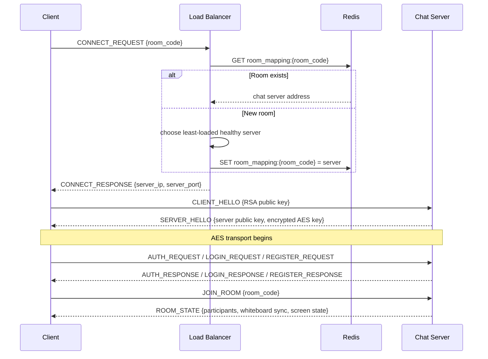

# ARCHITECTURE.md — QuicKonNect System Architecture

> **Status:** Implemented — document reflects the current codebase.
> **Last updated:** 2026-05-25

---

## Table of Contents

1. [Design Decisions & Assumptions](#1-design-decisions--assumptions)
2. [Overall System Design](#2-overall-system-design)
3. [Technology Stack](#3-technology-stack)
4. [Component Breakdown](#4-component-breakdown)
5. [Data Flow](#5-data-flow)
6. [Binary Protocol Specification](#6-binary-protocol-specification)
7. [Database Schema (PostgreSQL)](#7-database-schema-postgresql)
8. [Cryptography Architecture](#8-cryptography-architecture)
9. [Project Structure](#9-project-structure)
10. [UI/UX Design Notes](#10-uiux-design-notes)
11. [Key Trade-offs](#11-key-trade-offs)
12. [Phased Development Plan](#12-phased-development-plan)
13. [Current Implementation Status](#13-current-implementation-status)
14. [Known Limitations](#14-known-limitations)
15. [Future Improvements](#15-future-improvements)

---

## 1. Design Decisions & Assumptions

These decisions are based on the actual implemented system.

| # | Issue | Decision | Rationale |
|---|-------|----------|-----------|
| 1 | Real-time processing requires server access to media and whiteboard data | Use **transport encryption** for audio, screen, and whiteboard events. Apply true E2E only to direct chat message payloads when available. | The server must decrypt audio to mix it and must read whiteboard events to assign canonical sequence numbers. |
| 2 | No browser client is implemented | Build a **desktop-only** PyQt6 client. | Raw TCP socket communication is simpler for desktop code and matches the project's network programming goals. |
| 3 | Same-room clients must share the same server | Implement **room-aware load balancing** using Redis mapping. | Avoids cross-server media relay and keeps room state coherent. |
| 4 | Audio codec dependencies add installation friction | Transport **raw PCM audio** over TCP. | Raw PCM is easy to capture, mix, and playback without an additional codec dependency. |
| 5 | Screen frames should reuse the existing packet envelope | Encode screen frames as JPEG inside JSON payloads. | Keeps the protocol stable and avoids introducing a separate binary framing layer. |
| 6 | Returning a client's own audio causes echo | Server mixes all participants **except the recipient**. | Prevents self-echo and reduces unnecessary bandwidth. |

---

## 2. Overall System Design

```
┌─────────────────────────────────────────────────────────────────┐
│                          CLIENTS (PyQt6)                        │
│                                                                 │
│  ┌──────────┐  ┌──────────┐  ┌──────────┐  ┌──────────┐       │
│  │ Client A │  │ Client B │  │ Client C │  │ Client D │       │
│  └────┬─────┘  └────┬─────┘  └────┬─────┘  └────┬─────┘       │
└───────┼──────────────┼──────────────┼──────────────┼────────────┘
        │    TCP       │              │              │
        ▼              ▼              ▼              ▼
┌─────────────────────────────────────────────────────────────────┐
│                     LOAD BALANCER (Port 9000)                   │
│                                                                 │
│  • Accepts initial TCP connections from clients                 │
│  • Maintains room→server mapping in Redis                       │
│  • For new rooms: picks least-loaded server                     │
│  • For existing rooms: returns the server already hosting it    │
│  • Responds with assigned server IP:Port, then closes           │
│  • Periodic health checks to all chat servers                   │
└────────────┬───────────────────────────┬────────────────────────┘
             │  Internal TCP             │
             ▼                           ▼
┌──────────────────────┐   ┌──────────────────────┐
│   CHAT SERVER 1      │   │   CHAT SERVER 2      │
│   Port: 9001         │   │   Port: 9002         │
│                      │   │                      │
│  • Thread per client │   │  • Thread per client │
│  • Audio mixing      │   │  • Audio mixing      │
│  • Screen relay      │   │  • Screen relay      │
│  • Whiteboard sync   │   │  • Whiteboard sync   │
│  • Messaging         │   │  • Messaging         │
│  • Auth validation   │   │  • Auth validation   │
└──────────┬───────────┘   └──────────┬───────────┘
           │                          │
           └────────────┬─────────────┘
                        │
          ┌─────────────┼─────────────┐
          ▼                           ▼
┌──────────────────┐     ┌──────────────────────┐
│      Redis       │     │    PostgreSQL         │
│                  │     │                       │
│  • Room→server   │     │  • User accounts      │
│    mapping       │     │  • Friend lists       │
│  • Online users  │     │  • Message history    │
│  • Pub/sub for   │     │  • Room metadata      │
│    cross-server  │     │  • Whiteboard events  │
│    notifications │     │  • Whiteboard snapshots │
│                  │     │                       │
└──────────────────┘     └──────────────────────┘
```

### Client Responsibilities
- Initial load balancer handshake and assigned server connection
- RSA public key exchange and AES session key establishment
- Authentication with JWT, login, and registration
- Chat, friend list, room join/leave, and direct invite handling
- Screen sharing capture/display, remote control, and whiteboard interaction
- Audio capture, playback, and subtitle presentation
- Packet dispatch, reconnect logic, and graceful shutdown handling
- Local persistence of session tokens and RSA key material

### Load Balancer Responsibilities
- Accept initial TCP connections at port 9000
- Resolve room-to-server assignment via Redis
- Select the least-loaded healthy server for new rooms
- Route same-room clients to the room's existing chat server
- Perform periodic health probes of chat servers
- Return server assignment and close the LB connection

### Server Responsibilities
- Accept chat client connections and run one `ClientHandler` thread per client
- Perform RSA handshake, auth validation, and AES transport setup
- Manage room membership and per-room state objects
- Relay screen, remote-control, audio, subtitle, whiteboard, and chat traffic
- Mix audio streams and broadcast personalized mixed audio
- Persist users, sessions, messages, and whiteboard data in PostgreSQL
- Coordinate multi-server friend status and invites using Redis pub/sub

---

## 3. Technology Stack

| Layer | Technology | Actual Project Use |
|-------|-----------|--------------------|
| Client UI | Python 3.11+ / PyQt6 | Desktop UI, canvases, image encoding, packet routing |
| Chat Server | Python 3.11+ / `socket` + `threading` | Raw TCP server with one thread per client |
| Load Balancer | Python 3.11+ / `socket` + `threading` | Initial routing and health monitoring |
| Database | PostgreSQL | Persistent storage for users, sessions, messages, rooms, whiteboard data |
| Cache / Sync | Redis | Room assignment, online presence, pub/sub coordination |
| Audio | PyAudio | 16 kHz 16-bit mono PCM capture/playback |
| Screen Capture | `mss` | Host screen capture |
| JPEG Encoding | PyQt6 `QImage` / `QBuffer` | JPEG encode/decode for screen frames |
| Remote Control | `pyautogui` | Host-side mouse/keyboard execution |
| Speech-to-Text | `faster-whisper` | Optional local transcription |
| Translation | LibreTranslate | Optional subtitle translation endpoint |
| Cryptography | `cryptography`, `bcrypt` | AES-256-GCM, RSA-2048, HMAC-SHA256 JWTs |
| DB Driver | `psycopg[binary]`, `psycopg-pool` | PostgreSQL connection pooling |
| Redis Driver | `redis-py` | Redis commands and pub/sub |
| Testing | `pytest` | Automated tests |

---

## 4. Component Breakdown

### 4.1 Client Application

```
┌───────────────────────────────────────────────┐
│                CLIENT APPLICATION              │
│                                               │
│  ┌─────────────┐  ┌────────────────────────┐  │
│  │  Auth UI     │  │  Connection Manager    │  │
│  │  (Login/     │  │  (TCP socket,          │  │
│  │   Register)  │  │   handshake, heartbeat,│  │
│  │             │  │   reconnection)        │  │
│  └─────────────┘  └────────────────────────┘  │
│                                               │
│  ┌─────────────┐  ┌────────────────────────┐  │
│  │  Chat UI     │  │  Room UI               │  │
│  │  (Messages,  │  │  (screen view,         │  │
│  │   friends)   │  │   audio, whiteboard,   │  │
│  │             │  │   subtitles)           │  │
│  └─────────────┘  └────────────────────────┘  │
│                                               │
│  ┌──────────────────────────────────────────┐  │
│  │  Feature Engines (background threads)    │  │
│  │  • AudioEngine  — mic capture + playback │  │
│  │  • ScreenCaptureEngine — capture + send  │  │
│  │  • WhiteboardEngine — draw event sync    │  │
│  │  • RemoteControl — input capture/execute │  │
│  └──────────────────────────────────────────┘  │
└───────────────────────────────────────────────┘
```

Client modules:
- `client/main.py`
- `client/config.py`
- `client/storage/local_store.py`
- `client/network/connection.py`
- `client/network/lb_client.py`
- `client/ui/login_window.py`
- `client/ui/main_window.py`
- `client/ui/chat_widget.py`
- `client/ui/friend_list_widget.py`
- `client/ui/screen_share_widget.py`
- `client/ui/subtitle_widget.py`
- `client/ui/whiteboard_widget.py`
- `client/features/audio_engine.py`
- `client/features/screen_engine.py`
- `client/features/whiteboard_engine.py`
- `client/features/remote_control.py`
- `client/features/subtitle_display.py`

### 4.2 Chat Server

```
┌───────────────────────────────────────────────────────┐
│                    CHAT SERVER                         │
│                                                       │
│  ┌──────────────────┐  ┌──────────────────────────┐  │
│  │  Acceptor Thread  │  │  Health Reporter Thread  │  │
│  │  (new TCP conns)  │  │  (responds to LB probes) │  │
│  └────────┬─────────┘  └──────────────────────────┘  │
│           │ spawns                                    │
│           ▼                                          │
│  ┌──────────────────┐                                │
│  │  Client Handler  │ ← one per client connection    │
│  │  Thread          │                                │
│  │  • RSA handshake │                                │
│  │  • Auth + JWT    │                                │
│  │  • Packet router │                                │
│  └──────────────────┘                                │
│                                                      │
│  ┌──────────────────────────────────────────────┐    │
│  │  Room Manager (per active room)               │    │
│  │                                              │    │
│  │  ┌──────────────┐  ┌──────────────────────┐  │    │
│  │  │ Audio Mixer  │  │ Screen Relay State    │  │    │
│  │  └──────────────┘  └──────────────────────┘  │    │
│  │                                              │    │
│  │  ┌──────────────┐  ┌──────────────────────┐  │    │
│  │  │ Whiteboard   │  │ STT / Subtitle Pool    │  │    │
│  │  │ Manager      │  │                      │  │    │
│  │  └──────────────┘  └──────────────────────┘  │    │
│  └──────────────────────────────────────────────┘    │
│                                                      │
│  ┌──────────────────────────────────────────────┐    │
│  │  Shared Services                              │    │
│  │  • AuthService                                │    │
│  │  • MessageService                             │    │
│  │  • FriendService                              │    │
│  │  • DB pool + Redis client                     │    │
│  └──────────────────────────────────────────────┘    │
└─────────────────────────────────────────────────────────────────┘
```

Server modules:
- `server/main.py`
- `server/config.py`
- `server/acceptor.py`
- `server/client_handler.py`
- `server/room_manager.py`
- `server/services/db.py`
- `server/services/auth_service.py`
- `server/services/message_service.py`
- `server/services/friend_service.py`
- `server/features/audio_mixer.py`
- `server/features/screen_relay.py`
- `server/features/whiteboard.py`
- `server/features/stt_worker.py`
- `server/features/subtitle.py`

### 4.3 Load Balancer

Load balancer modules:
- `loadbalancer/main.py`
- `loadbalancer/config.py`
- `loadbalancer/router.py`
- `loadbalancer/health_checker.py`

---

## 5. Data Flow

### 5.1 Connection and Room Join Flow



### 5.2 Packet Routing

- Client `ConnectionManager` receives packets and queues them
- `client/ui/main_window.py` polls the queue and dispatches by packet type
- Server `ClientHandler` routes packets to auth, room, chat, audio, screen, whiteboard, friend, and health handlers
- `server/room_manager.py` exposes the current room state to connected handlers

### 5.3 Screen Sharing Flow

- Host sends `SCREEN_START`
- Host captures screen with `mss`, encodes JPEG via Qt, and sends `SCREEN_FRAME`
- Server fans out `SCREEN_RELAY` to room viewers
- Viewers may request remote control with `REMOTE_REQUEST`
- Host accepts/rejects via `REMOTE_GRANT`
- Viewer sends normalized `REMOTE_EVENT` inputs to the host
- Host executes events with `pyautogui`

### 5.4 Audio + Subtitle Pipeline

- Client captures raw PCM and sends `AUDIO_CHUNK`
- The client encodes PCM as base64 inside the packet payload for JSON-compatible transport.
- Server buffers each participant's frames in jitter buffers
- Mixing thread runs every 20 ms and sends `MIXED_AUDIO` to each client excluding their own audio
- STT workers generate transcripts from audio frames
- `SUBTITLE` packets carry transcript text and optional translations
- Client overlays subtitles in the room UI

### 5.5 Whiteboard Synchronization

- Client sends `DRAW_EVENT` actions to the server
- Server assigns a canonical `seq_num`, persists the event, and broadcasts `DRAW_BROADCAST`
- Clients apply events optimistically and reconcile with server order
- New room joiners receive `WHITEBOARD_SYNC` with the latest snapshot and recent active events
- Periodic snapshotting saves the whiteboard PNG to `whiteboard_snapshots`

### 5.6 Reconnections

- Clients can enable reconnect after authentication
- On disconnect, the client attempts reconnects with exponential backoff
- On success, the client re-handshakes, re-authenticates, and rejoins rooms
- A reconnect banner displays progress in the UI

### 5.7 Redis / PostgreSQL Usage

- Redis stores volatile cross-server state and room-to-server mappings
- Redis pub/sub delivers friend status and room invites across servers
- PostgreSQL stores durable user, session, message, room, and whiteboard data

---

## 6. Binary Protocol Specification

All packets use a 40-byte header with an optional encrypted payload.

Header layout:
- 4 bytes: magic = "QKNT"
- 2 bytes: protocol version = 1
- 2 bytes: packet type
- 4 bytes: payload length
- 12 bytes: AES-GCM nonce
- 16 bytes: AES-GCM auth tag

Non-plaintext packets use AES-256-GCM. The header is authenticated as AAD.

### Packet Types

| Code | Name | Direction | Purpose |
|------|------|-----------|---------|
| `0x0001` | `CLIENT_HELLO` | C→S | Client RSA public key |
| `0x0002` | `SERVER_HELLO` | S→C | Server public key + encrypted AES key |
| `0x0010` | `AUTH_REQUEST` | C→S | Validate JWT |
| `0x0011` | `AUTH_RESPONSE` | S→C | Auth result |
| `0x0012` | `REGISTER_REQUEST` | C→S | Register user |
| `0x0013` | `REGISTER_RESPONSE` | S→C | Registration result |
| `0x0014` | `LOGIN_REQUEST` | C→S | Login with username/password |
| `0x0015` | `LOGIN_RESPONSE` | S→C | Login result + JWT |
| `0x0020` | `JOIN_ROOM` | C→S | Join room |
| `0x0021` | `ROOM_STATE` | S→C | Current room state |
| `0x0022` | `LEAVE_ROOM` | C→S | Leave room |
| `0x0023` | `ROOM_UPDATE` | S→C | Participant change |
| `0x0024` | `ROOM_INVITE` | C→S | Invite user |
| `0x0025` | `ROOM_INVITE_NOTIFY` | S→C | Deliver invite |
| `0x0030` | `CHAT_MESSAGE` | C→S / S→C | Chat message |
| `0x0031` | `MESSAGE_HISTORY` | S→C | Previous messages |
| `0x0040` | `AUDIO_CHUNK` | C→S | PCM audio frame |
| `0x0041` | `MIXED_AUDIO` | S→C | Mixed audio frame |
| `0x0042` | `SUBTITLE` | S→C | Transcript / translation |
| `0x0050` | `SCREEN_FRAME` | C→S | Screen JPEG frame |
| `0x0051` | `SCREEN_RELAY` | S→C | Forwarded screen frame |
| `0x0052` | `SCREEN_START` | C→S | Start screen share |
| `0x0053` | `SCREEN_STOP` | C→S | Stop screen share |
| `0x0060` | `REMOTE_EVENT` | C→S / S→C | Remote control input |
| `0x0061` | `REMOTE_REQUEST` | C→S | Request remote control |
| `0x0062` | `REMOTE_GRANT` | C→S | Grant/revoke control |
| `0x0070` | `DRAW_EVENT` | C→S | Whiteboard action |
| `0x0071` | `DRAW_BROADCAST` | S→C | Broadcast event |
| `0x0072` | `DRAW_ACK` | S→C | Event acknowledgment |
| `0x0073` | `WHITEBOARD_SYNC` | S→C | Snapshot + event replay |
| `0x0074` | `EXPORT_REQUEST` | C→S | Export whiteboard PNG |
| `0x0075` | `FILE_TRANSFER` | S→C | File payload |
| `0x0080` | `FRIEND_REQUEST` | C→S | Send friend request |
| `0x0081` | `FRIEND_RESPONSE` | C→S | Accept/reject friend request |
| `0x0082` | `FRIEND_LIST` | S→C | Friend list |
| `0x0083` | `FRIEND_UPDATE` | S→C | Friend status update |
| `0x0090` | `PUBLIC_KEY_ANNOUNCE` | C→S | Announce DM public key |
| `0x0091` | `PUBLIC_KEY_REQUEST` | C→S | Request peer public key |
| `0x0092` | `PUBLIC_KEY_RESPONSE` | S→C | Public key response |
| `0x00F0` | `CONNECT_REQUEST` | C→LB | Initial LB routing request |
| `0x00F1` | `CONNECT_RESPONSE` | LB→C | Assigned chat server address |
| `0x00F2` | `HEALTH_QUERY` | LB→S | LB health probe |
| `0x00F3` | `HEALTH_RESPONSE` | S→LB | Server health response |
| `0x00FE` | `HEARTBEAT` | Both | Keepalive |
| `0x00FD` | `SERVER_SHUTDOWN` | S→C | Graceful shutdown |
| `0x00FF` | `ERROR` | S→C | Error payload |

---

## 7. Database Schema (PostgreSQL)

The current implementation uses the schema created by `scripts/setup_db.py`.

Key tables:
- `users`: user accounts and password hashes
- `sessions`: JWT session records
- `friendships`: friend request and acceptance relationships
- `rooms`: room metadata and unique room codes
- `room_participants`: join/leave history per room
- `messages`: stored chat messages
- `whiteboard_events`: persisted whiteboard actions and sequence numbers
- `whiteboard_snapshots`: periodic snapshots of whiteboard state as PNG bytes

Notes:
- Timestamps are stored as `TIMESTAMPTZ`
- `whiteboard_events.payload` is `JSONB`
- `whiteboard_snapshots.snapshot_png` is `BYTEA`
- Referential integrity uses `ON DELETE CASCADE`

---

## 8. Cryptography Architecture

### Transport Encryption

- RSA-2048 handshake per TCP session
- Client sends `CLIENT_HELLO` with its RSA public key
- Server responds with `SERVER_HELLO` containing an AES session key encrypted for the client
- Subsequent packets are AES-256-GCM encrypted when the session key is available
- Header fields are authenticated as AAD

### Authentication and JWT

- BCrypt stores password hashes securely
- JWTs use HMAC-SHA256 and expire after 24 hours
- Clients may persist JWTs locally for session resumption
- Reconnection uses JWT or login credentials to re-authenticate

### Direct Message Key Exchange

- `PUBLIC_KEY_ANNOUNCE` lets clients share persistent DM public keys
- `PUBLIC_KEY_REQUEST` / `PUBLIC_KEY_RESPONSE` retrieve peer public keys
- This supports message-level encryption without exposing private keys to the server

---

## 9. Project Structure

... [trimmed for brevity in code] ...
