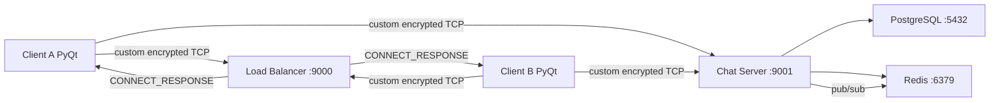
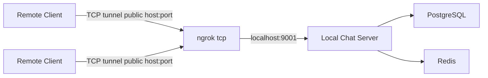
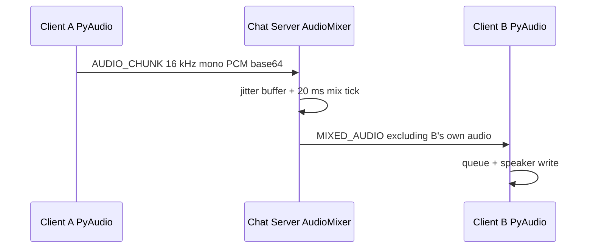
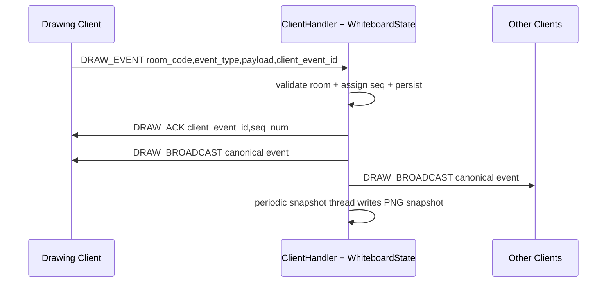

# QuicKonNect Stream, I/O, Async, and Ngrok Report

## Table of Contents
1. [Executive Summary](#executive-summary)
2. [Architecture Overview](#architecture-overview)
3. [Stream & I/O Audit](#stream--io-audit)
4. [Async & Concurrency Audit](#async--concurrency-audit)
5. [WebSocket / Socket.IO Flows](#websocket--socketio-flows)
6. [WebRTC / Audio Flows](#webrtc--audio-flows)
7. [Whiteboard Flows](#whiteboard-flows)
8. [Potential Risks & Bugs](#potential-risks--bugs)
9. [Recommended Refactors](#recommended-refactors)
10. [Ngrok Deployment Guide](#ngrok-deployment-guide)
11. [Environment Variables](#environment-variables)
12. [Testing Checklist](#testing-checklist)
13. [Known Limitations](#known-limitations)

## Executive Summary
QuicKonNect is a PyQt6 desktop application backed by a custom encrypted TCP protocol. It is not a web frontend and does not use HTTP APIs, CORS, WebSocket, Socket.IO, browser WebRTC, Vite, Next.js, or JavaScript async/await. Real-time behavior is implemented with Python sockets, Qt signals, `QTimer` polling, `QThread` workers, Python daemon threads, Redis pub/sub, PostgreSQL I/O, PyAudio, QtMultimedia camera frames, MSS screen capture, and server-side room state.

The main real-time flows are chat and file messages, room membership, microphone capture and server-side audio mixing, camera frame relay, screen sharing, remote control, whiteboard drawing events, subtitles/STT, friend presence, and room invites.

One required code fix was implemented for internet demos: the existing Ngrok helper assumed `python -m client.main --host ... --port ...` worked, but `client.main` had no CLI parsing. It also suggested tunneling the load balancer port, which is insufficient for remote clients because the load balancer returns a separate chat server host/port. The client now supports `--host`, `--port`, `--direct-server`, `--data-dir`, and `QUICKONNECT_DIRECT_SERVER=1`; `scripts/ngrok_setup.py` now defaults to tunneling the chat server port `9001` and prints correct direct-server instructions.

## Architecture Overview
The application has three runtime layers:

- **Desktop client**: PyQt6 GUI, encrypted TCP client, local file/key storage, microphone capture/playback, camera capture, screen sharing, remote control, whiteboard UI, and packet polling.
- **Chat server**: TCP acceptor, one `ClientHandler` thread per client, auth, room state, room routing, media relays, audio mixer, whiteboard persistence, Redis pub/sub, and PostgreSQL services.
- **Load balancer**: TCP load balancer assignment endpoint, health-check thread, Redis-backed room-to-server routing.



For a simple Ngrok demo, skip the load balancer and expose one chat server port directly:



## Stream & I/O Audit
| File path | Function / module | Description | Type of flow | Side | Potential risks or bugs |
|---|---|---|---|---|---|
| `shared/protocol.py` | `_recv_exact`, `read_packet`, `send_packet`, `encode_packet`, `decode_header` | Custom packet framing over TCP with optional AES-GCM encryption. | Network I/O, data stream | Shared | `_recv_exact` blocks until bytes arrive; malformed packet types raise; `MAX_PAYLOAD_SIZE` is 16 MB, so memory can spike if many media/file frames arrive concurrently. |
| `client/network/connection.py` | `ConnectionManager.connect` | Opens TCP socket, performs RSA handshake, starts receiver and heartbeat threads. | Network I/O, thread | Client | Socket connect timeout is fixed at 10 seconds. Reconnect uses direct server address, which is correct after initial LB routing but fragile if public endpoint changes. |
| `client/network/connection.py` | `ConnectionManager.send` | Thread-safe packet send via `_send_lock`. | Network I/O, concurrency | Client | Silent return when disconnected can hide lost media/control packets. Send failure can be triggered from worker threads and starts disconnect handling. |
| `client/network/connection.py` | `_receiver_loop` | Reads packets from socket and puts them on `packet_queue`. | Thread, stream | Client | Queue is unbounded; sustained media/control bursts could accumulate if UI polling stalls. |
| `client/network/connection.py` | `_heartbeat_loop` | Sends heartbeat packet every `HEARTBEAT_INTERVAL`. | Timer/thread | Client | Uses `time.sleep`, so shutdown can wait up to one heartbeat interval before thread exits. |
| `client/network/connection.py` | `_reconnect_loop`, `_do_reconnect_auth`, `_do_rejoin_rooms` | Exponential-backoff reconnect, auth, room rejoin. | Thread, network I/O | Client | Local media engines are shut down by UI disconnect handling and are not automatically restarted after reconnect. Room rejoin sends packets but does not wait for each `ROOM_STATE`. |
| `client/network/lb_client.py` | `request_server` | Short-lived TCP request to load balancer for server assignment. | Network I/O | Client | Rewrites loopback server addresses to LB host for LAN. For Ngrok, direct server mode is safer because LB assignment does not expose chat server port. |
| `client/main.py` | `_apply_cli_args`, `_enable_direct_server_mode` | New CLI/env support for direct Ngrok TCP connections. | Configuration, startup I/O | Client | Direct mode bypasses room-aware LB routing; intended for one-server demos only. |
| `client/ui/login_window.py` | `_AuthWorker.run` | QThread connects to LB/server and performs login/register/token auth. | QThread, network I/O | Client | Consumes from shared `packet_queue` before main polling starts. Safe at login, but reusing the same queue pattern elsewhere can race with UI polling. |
| `client/ui/main_window.py` | `_JoinRoomWorker.run` | Stops polling, asks LB for room server, reconnects, re-authenticates, joins room. | QThread, network I/O | Client | It intentionally disconnects current socket to switch servers. Active media is not explicitly stopped before this worker runs; UI room state may lag during routing. |
| `client/ui/main_window.py` | `_start_packet_polling`, `_poll_packets` | UI timer polls `ConnectionManager.packet_queue` every 16 ms. | Timer, event-driven | Client | Polling catches all exceptions and breaks, which can hide a packet-handling bug until logs are inspected. |
| `client/ui/main_window.py` | `_handle_packet` | Routes all received packets to widgets and handlers. | Event-driven | Client | Large `if/elif` router makes missing packet handlers easy. Adding packet types requires edits here. |
| `client/storage/local_store.py` | session/key methods | Reads/writes JSON session and RSA key files. | File I/O | Client | Private keys are stored unencrypted on disk. File writes are not atomic. |
| `client/ui/chat_widget.py` | `_on_attach`, `save_file_from_message` | Reads selected files, base64 encodes attachments, saves received files. | File I/O, UI event | Client | File read happens on UI thread. 10 MB limit avoids worst cases but can still freeze UI briefly. There is no download button path wired to `save_file_from_message`. |
| `client/features/audio_engine.py` | `start`, `_preflight_streams`, `_open_best_stream` | Opens PyAudio devices and starts capture/playback threads. | Audio stream, thread, device I/O | Client | Device probing is robust, but shared PyAudio instance is accessed from multiple threads. Shutdown relies on join timeouts. |
| `client/features/audio_engine.py` | `_capture_loop` | Reads microphone PCM, resamples to 16 kHz, sends `AUDIO_CHUNK`. | Audio stream, network I/O, thread | Client | If network send fails, capture thread calls send and disconnect handling indirectly. Audio is raw PCM over TCP, so internet latency can degrade voice. |
| `client/features/audio_engine.py` | `feed_playback`, `_playback_loop` | Queues mixed audio and writes to speaker device. | Audio stream, queue, thread | Client | Playback queue drops frames when full. This is good for latency but can sound choppy under Ngrok or poor networks. |
| `server/features/audio_mixer.py` | `feed_audio`, `_mixer_loop`, `_mix_tick` | Per-room jitter buffers and 20 ms server-side audio mixing. | Audio stream, thread | Server | Mixer starts lazily. `_running` is read outside lock in places; low risk but should be tightened. TCP jitter over Ngrok can cause underruns. |
| `server/features/stt_worker.py` | `feed_audio`, `_transcribe`, `_get_model` | Buffers audio and submits 3-second chunks to a `ThreadPoolExecutor`. | Worker pool, audio I/O | Server | Whisper model load is expensive. `shutdown(wait=False)` can leave in-flight transcriptions running briefly. |
| `server/features/subtitle.py` | `broadcast_transcript`, `_translate` | Sends subtitles and optionally calls LibreTranslate over HTTP. | Network I/O, event-driven | Server | Translation call is synchronous inside STT worker callback; slow translation delays subtitle output for that STT job. |
| `client/features/camera_engine.py` | `start`, `_ensure_camera_permission`, `_on_video_frame` | QtMultimedia camera capture, permission request, JPEG encode, `CAMERA_FRAME` send. | Video stream, event-driven | Client | Emits `started` immediately after `QCamera.start`, before first frame. Camera permission and OS device availability remain platform-sensitive. |
| `server/features/camera_state.py` | `CameraState` | Tracks active cameras in a room. | Concurrency state | Server | State is memory-only; reconnecting users must restart camera. |
| `server/client_handler.py` | `_handle_camera_start`, `_handle_camera_stop`, `_handle_camera_frame` | Validates room membership and relays camera frames. | Network I/O, video stream | Server | Relays JPEG without decoding. Payload size is capped at 1 MB, but no FPS throttling server-side. |
| `client/features/screen_engine.py` | `ScreenCaptureEngine.start`, `_capture_loop`, `_send_loop` | Captures screen with MSS, encodes JPEG, queues and sends `SCREEN_FRAME`. | Video stream, thread, queue | Client | `stop()` does not join capture/send threads. Queue depth is bounded, but screen sharing over Ngrok can saturate tunnel bandwidth. |
| `server/features/screen_relay.py` | `ScreenRelayState` | Tracks current screen sharer and controller. | Concurrency state | Server | Single share per room. In-memory only; state resets when room is destroyed. |
| `server/client_handler.py` | `_handle_screen_start`, `_handle_screen_stop`, `_handle_screen_frame` | Enforces current sharer and relays screen JPEG frames. | Network I/O, video stream | Server | No server-side validation of JPEG content or dimensions. Large frames limited only by global packet size. |
| `client/features/remote_control.py` | `RemoteControlSender` | Installs Qt event filter on screen view and sends mouse/key/wheel events. | Event listener, network I/O | Client | High-frequency mouse move events are not throttled; can flood slow tunnels. Detach cleanup is present. |
| `client/features/remote_control.py` | `RemoteControlExecutor` | Dedicated thread executes pyautogui actions from a queue. | Worker thread, input I/O | Client | Queue is unbounded; a burst of stale remote events could execute after lag unless cleared on revoke/stop. Stop drains queue. |
| `client/features/whiteboard_engine.py` | `send_draw_event`, `send_export_request` | Formats whiteboard TCP packets. | Event stream, network I/O | Client | Event IDs are username-counter scoped per process; reconnect/restart can reuse IDs. Server keeps limited duplicate cache. |
| `client/ui/whiteboard_widget.py` | `WhiteboardScene` mouse event overrides | Captures local draw gestures and emits completed vector events. | Event listener | Client | Pen strokes can contain many points; no client-side simplification or point-count cap. |
| `client/ui/screen_share_widget.py` | `on_draw_broadcast`, `on_whiteboard_sync`, export handlers | Applies remote whiteboard state, saves/export PNGs. | Event-driven, file I/O | Client | Whiteboard export save path uses direct file write in UI thread. |
| `server/features/whiteboard.py` | `WhiteboardState.add_event`, `get_active_events`, `render_png` | Persists drawing events, renders PNG snapshots/exports. | DB I/O, thread, rendering | Server | `add_event` updates memory before DB commit; if DB write fails, clients still see an event that is not persisted. |
| `server/features/whiteboard.py` | `_periodic_snapshot_loop` | Background snapshot every 60 seconds. | Timer/thread, DB/file-like buffer I/O | Server | `stop()` only flips a flag; room teardown does not join the snapshot thread. Snapshot can continue briefly after room deletion. |
| `server/client_handler.py` | `_handle_draw_event`, `_handle_export_request` | Validates draw events, assigns seq, broadcasts, exports PNG. | Event stream, network I/O, DB I/O | Server | Payload validation is shallow; no point count, coordinate, text length, or color validation. |
| `server/acceptor.py` | `Acceptor.run` | TCP server socket accept loop, starts one `ClientHandler` thread per client. | Network I/O, thread | Server | Thread-per-client is simple but can exhaust resources under many connections. |
| `server/client_handler.py` | `ClientHandler.run`, `_main_loop`, `_dispatch`, `send` | Per-client TCP lifecycle, auth, packet dispatch, thread-safe sends. | Network I/O, thread | Server | Each handler can block on DB/service work. One slow handler thread does not block all clients, but many blocked threads can accumulate. |
| `server/client_handler.py` | `_handle_chat_message` | Stores messages, broadcasts room/DM messages, Redis pub/sub for cross-server DMs. | DB I/O, Redis pub/sub, network I/O | Server | File/image content is stored base64 in DB; max 10 MB attachment becomes larger in text storage. |
| `server/main.py` | `_start_pubsub_listener`, `_pubsub_loop` | Redis pub/sub for presence, friends, DMs, invites. | Background thread, Redis stream | Server | Pub/sub loop logs only debug on failure, which can hide delivery failures. |
| `server/main.py` | `_register_server` | Registers chat server host/port in Redis. | Redis I/O, config | Server | Converts `0.0.0.0` to `127.0.0.1`, which is right for local health checks but wrong as a public address. Direct Ngrok mode avoids this. |
| `server/room_manager.py` | room lifecycle methods | Thread-safe active room map, Redis room pins, DB participant records. | Concurrency, DB/Redis I/O | Server | Uses one lock around room map. Calls to DB happen outside most locks except in some lifecycle methods; this is mostly good, but cleanup notification is split across caller and manager. |
| `loadbalancer/main.py` | `LoadBalancer.start` | TCP accept loop and per-request router threads. | Network I/O, thread | Load balancer | No cap on spawned router threads. |
| `loadbalancer/health_checker.py` | `HealthChecker.run`, `_check_one` | Periodic TCP health checks to chat servers. | Timer/thread, network I/O | Load balancer | Fixed interval checks can mark servers down during transient stalls. |
| `loadbalancer/router.py` | `handle_client`, `_resolve`, `_advertised_host` | Short-lived TCP routing responses and Redis room pinning. | Network I/O, Redis I/O | Load balancer | Works for LAN when server ports are reachable. Not enough for Ngrok unless the advertised chat server host/port is also public. |
| `scripts/demo_launch.py` | `main`, `check_dependency`, subprocess management | Starts local demo processes and checks Redis/Postgres/LB/server ports. | Process I/O, network I/O | Tooling | Uses hardcoded local defaults. Good for local demo, not a public deployment manager. |
| `scripts/ngrok_setup.py` | `main`, `get_tunnel_url` | Starts Ngrok TCP tunnel and reads local Ngrok API. | Process I/O, HTTP local API | Tooling | Requires ngrok TCP tunnel support and a running local chat server. |

## Async & Concurrency Audit
The most important asynchronous flows are:

- **Client socket receiver and heartbeat threads** in `client/network/connection.py`.
- **Qt packet polling timer** in `client/ui/main_window.py`.
- **Login and room-join QThreads** in `client/ui/login_window.py` and `client/ui/main_window.py`.
- **Microphone capture/playback threads** in `client/features/audio_engine.py`.
- **Server audio mixer thread** in `server/features/audio_mixer.py`.
- **Screen capture/send threads** in `client/features/screen_engine.py`.
- **Remote-control executor thread** in `client/features/remote_control.py`.
- **Server acceptor and per-client threads** in `server/acceptor.py` and `server/client_handler.py`.
- **Redis pub/sub thread** in `server/main.py`.
- **Whiteboard snapshot thread** in `server/features/whiteboard.py`.
- **STT `ThreadPoolExecutor` jobs** in `server/features/stt_worker.py`.
- **Load balancer health-check and router threads** in `loadbalancer/health_checker.py` and `loadbalancer/main.py`.

Problematic or fragile concurrency areas:

- Some background threads are daemon threads and not always joined (`ScreenCaptureEngine.stop`, `WhiteboardState.stop`, `HealthChecker.stop`). This is acceptable for demo shutdown but less clean for long-running production.
- Several queues are unbounded (`ConnectionManager.packet_queue`, `RemoteControlExecutor._queue`). Media queues are bounded, but control and packet queues can grow if consumers stall.
- UI packet polling catches all exceptions and breaks the polling loop for that tick without surfacing the original handler error.
- Room switching and reconnecting can stop/restart network state while media engines are active. Recent fixes stop screen/audio/camera on room changes, but reconnect does not automatically restore local camera/mic/screen state.
- Server-side whiteboard memory can diverge from persistence if DB write fails after `_events` is updated.

## WebSocket / Socket.IO Flows
There are no WebSocket or Socket.IO flows in this codebase. All realtime client/server traffic uses the custom TCP packet protocol in `shared/protocol.py` over Python sockets. Therefore:

- No `VITE_SOCKET_URL`, `NEXT_PUBLIC_SOCKET_URL`, Socket.IO path, or WebSocket upgrade setting is used.
- No WebSocket CORS configuration exists or is required.
- Ngrok must use a TCP tunnel, not an HTTP tunnel, for the desktop clients.

## WebRTC / Audio Flows
There is no browser WebRTC flow. There are no `RTCPeerConnection`, ICE, SDP offer/answer, `getUserMedia`, or browser autoplay paths. Microphone and speaker handling is local PyAudio, and audio is relayed over the custom encrypted TCP connection.



Audio-specific risks:

- Ngrok TCP adds internet latency and jitter. The current audio design is server-mixed raw PCM over TCP, so it is more sensitive to latency than WebRTC/UDP.
- Playback intentionally drops frames when the queue is full to avoid accumulating delay.
- Linux/macOS device rates are handled with client-side resampling, but device permissions and OS audio settings still matter.
- Secure browser context requirements do not apply because this is a desktop app, not a browser app.

## Whiteboard Flows
Whiteboard flow:



Important whiteboard code paths:

- `client/ui/whiteboard_widget.py`: captures local drawing gestures and applies canonical remote events.
- `client/features/whiteboard_engine.py`: sends draw/export packets.
- `server/client_handler.py::_handle_draw_event`: validates room membership and broadcasts canonical events.
- `server/features/whiteboard.py`: assigns sequence numbers, stores events, computes active events after undo, renders PNG snapshots/exports.

Risks:

- Payload validation should be strengthened for maximum point count, coordinate range, text length, color format, and stroke width.
- Server memory updates happen before DB persistence success.
- Snapshot thread is stopped by flag but not joined.

## Potential Risks & Bugs
1. **Ngrok/LB mismatch fixed in this change**: `scripts/ngrok_setup.py` previously told users to pass CLI args unsupported by `client.main`, and tunneling only the LB would not expose the chat server selected by the LB. Direct server mode was added.
2. **No automatic media resume after reconnect**: reconnect rejoins rooms but does not restart local camera, screen share, or mic state beyond the base audio engine tied to current room state.
3. **Unbounded queues**: `ConnectionManager.packet_queue` and remote-control executor queue can grow under handler stalls or slow UI.
4. **Whiteboard persistence divergence**: server broadcasts an event even if DB persistence fails inside `WhiteboardState.add_event`.
5. **Screen share stop cleanup**: screen capture/send threads are signaled but not joined, so short-lived overlap can occur after stop.
6. **Server thread-per-client design**: simple and acceptable for a small research/demo app, but not scalable to many public clients.
7. **Attachment storage**: base64 file/image content is stored in the DB, which is inefficient for repeated large messages.
8. **Remote-control flood risk**: mouse move events are sent immediately and can saturate slow links.
9. **Redis/server address assumptions**: LB routing assumes chat server ports are reachable by clients. This is true on LAN with correct advertised host, but not true through a single Ngrok LB tunnel.
10. **Local key storage**: E2E private keys are stored without passphrase protection.

## Recommended Refactors
- Add bounded sizes to `ConnectionManager.packet_queue` and `RemoteControlExecutor._queue`, with drop-oldest behavior for high-frequency realtime packets.
- Introduce a central packet router map instead of the long `if/elif` chain in `MainWindow._handle_packet`.
- Add strict whiteboard payload schemas and limits.
- Make `WhiteboardState.add_event` persist first or mark events as volatile until DB commit succeeds.
- Join or explicitly track lifecycle of screen capture and whiteboard snapshot threads.
- Add server-side FPS/rate limiting for camera/screen/remote-control packets.
- For internet voice quality, consider a future WebRTC/UDP media path or a compressed audio codec. The current TCP PCM design works best on LAN and small demos.
- Move large file/image attachments from DB text fields to object/file storage with metadata in PostgreSQL.

## Ngrok Deployment Guide
This project is a desktop TCP app. There is no web frontend server to expose. The "frontend" is the PyQt client running locally on each user's machine.

### Local Ports
| Service | Default port | Notes |
|---|---:|---|
| PostgreSQL | `5432` | Local database from Docker Compose or system install. |
| Redis | `6379` | Required for server registry, room pins, presence, pub/sub. |
| Load balancer | `9000` | Used for local/LAN multi-server routing. Not recommended as the only Ngrok tunnel. |
| Chat server | `9001` | Recommended Ngrok target for a one-server internet demo. |
| Additional chat server | `9002` | Optional local multi-server demos. |
| Ngrok local API | `4040` | Used by `scripts/ngrok_setup.py` to print public TCP address. |
| LibreTranslate | commonly `5000` | Optional subtitle translation only if `LIBRETRANSLATE_URL` is set. |

### Recommended One-Server Ngrok Demo
1. Start dependencies:

```bash
docker compose up -d postgres redis
```

2. Initialize the database once:

```bash
python -m scripts.setup_db
```

3. Start one chat server:

```bash
SERVER_HOST=0.0.0.0 SERVER_PORT=9001 SERVER_ID=server-9001 python -m server.main
```

4. Start an Ngrok TCP tunnel to the chat server:

```bash
python -m scripts.ngrok_setup --port 9001
```

The script prints a public address such as:

```text
tcp://0.tcp.ngrok.io:12345
```

5. Start each remote client in direct-server mode:

```bash
python -m client.main --direct-server --host 0.tcp.ngrok.io --port 12345
```

Equivalent environment variable form:

```bash
LB_HOST=0.tcp.ngrok.io LB_PORT=12345 QUICKONNECT_DIRECT_SERVER=1 python -m client.main
```

This works because direct-server mode treats the host/port fields as the actual chat server endpoint and bypasses load-balancer assignment.

### Does the Frontend Need Ngrok?
No. The client is a desktop PyQt app, not a browser frontend. Each user runs the client locally and points it to the Ngrok TCP host/port.

### Can the Load Balancer Be Exposed Instead?
Only exposing `9000` is not enough for most Ngrok setups. The LB returns a chat server host/port, usually `127.0.0.1:9001` or a LAN address, and remote clients cannot connect to that unless the chat server port is also publicly reachable. For a one-server demo, expose `9001` directly and use `--direct-server`.

For a multi-server public deployment, each chat server needs a reachable public address, and the LB/router would need to advertise those public addresses. This project currently does not have a full public multi-server address registry.

### WebSocket / Socket.IO URL Changes
Not applicable. There is no WebSocket or Socket.IO code.

### API Base URL Changes
Not applicable. There is no HTTP API used by the PyQt client for application traffic. The app uses custom TCP sockets.

### CORS Changes
Not applicable. CORS is a browser HTTP policy. The PyQt TCP client is not subject to CORS.

### WebRTC Signaling URL Changes
Not applicable. There is no WebRTC signaling server, SDP, ICE, STUN, or TURN path.

### HTTPS / Secure Context Requirements
Not applicable for microphone/camera capture in this desktop app. Browser HTTPS secure-context rules do not apply. OS-level permissions still apply:

- macOS: allow microphone/camera for the app, Terminal, or Python launcher in System Settings.
- Linux: ensure PulseAudio/PipeWire/ALSA input and output devices are available and unmuted.

### Avoiding Hardcoded Localhost
Use these for remote demos:

```bash
python -m client.main --direct-server --host <ngrok-tcp-host> --port <ngrok-tcp-port>
```

or:

```bash
LB_HOST=<ngrok-tcp-host>
LB_PORT=<ngrok-tcp-port>
QUICKONNECT_DIRECT_SERVER=1
python -m client.main
```

Do not tell remote users to connect to `127.0.0.1`, `localhost`, or a LAN IP unless they are on the same machine/LAN.

## Environment Variables
| Variable | Used by | Purpose | Default |
|---|---|---|---|
| `LB_HOST` | Client, server | Client login host field; server LB reference. In direct Ngrok mode, this is the Ngrok TCP host. | `127.0.0.1` client, server config default |
| `LB_PORT` | Client, server | Client login port field; server LB reference. In direct Ngrok mode, this is the Ngrok TCP port. | `9000` |
| `QUICKONNECT_DIRECT_SERVER` | Client | When `1`, bypass LB and connect directly to `LB_HOST:LB_PORT`. | `0` |
| `QUICKONNECT_DATA` | Client | Local session/key storage directory. Useful to run two local clients with separate state. | `~/.quickonnect` |
| `SERVER_HOST` | Server | Chat server bind host. Use `0.0.0.0` for local Ngrok target. | `0.0.0.0` |
| `SERVER_PORT` | Server | Chat server TCP port. Recommended Ngrok target is `9001`. | `9001` |
| `SERVER_ID` | Server | Server registry ID. | `server-<port>` |
| `DB_HOST`, `DB_PORT`, `DB_NAME`, `DB_USER`, `DB_PASSWORD` | Server/scripts | PostgreSQL settings. | local quickonnect defaults |
| `DATABASE_URL` | Demo launcher | PostgreSQL DSN override for `scripts/demo_launch.py`. | local quickonnect DSN |
| `REDIS_HOST`, `REDIS_PORT` | Server/LB/demo | Redis connection settings. | `127.0.0.1:6379` |
| `CHAT_SERVERS` | Load balancer | Comma list `server_id:host:port`. | `server-9001`, `server-9002` local |
| `JWT_SECRET` | Server | JWT signing secret. Change outside local demos. | dev secret |
| `ENABLE_STT` | Server | Enable faster-whisper STT when set to `1`. | `0` |
| `LIBRETRANSLATE_URL` | Server | Optional translation endpoint for subtitles. | unset |
| `SUBTITLE_TARGET_LANG` | Server | Optional translation target language. | unset |

The prompt examples `VITE_API_BASE_URL`, `VITE_SOCKET_URL`, `NEXT_PUBLIC_API_BASE_URL`, `NEXT_PUBLIC_SOCKET_URL`, `SERVER_PUBLIC_URL`, and `CLIENT_ORIGIN` do not apply because this is not a Vite/Next/browser app.

## Testing Checklist
### Local Sanity Test
1. `docker compose up -d postgres redis`
2. `python -m scripts.setup_db`
3. `SERVER_HOST=0.0.0.0 SERVER_PORT=9001 python -m server.main`
4. Client A: `QUICKONNECT_DATA=/tmp/qk-a python -m client.main --direct-server --host 127.0.0.1 --port 9001`
5. Client B: `QUICKONNECT_DATA=/tmp/qk-b python -m client.main --direct-server --host 127.0.0.1 --port 9001`
6. Register/login two users, join the same room, test chat.

### Ngrok Two-Network Test
1. On host machine, start Postgres, Redis, and chat server on `9001`.
2. Run `python -m scripts.ngrok_setup --port 9001`.
3. Copy the printed Ngrok TCP host and port.
4. On device/network A, run `python -m client.main --direct-server --host <ngrok-host> --port <ngrok-port>`.
5. On device/network B, run the same command.
6. Register/login both users and join the same room code.

### Verify Whiteboard Through Ngrok
1. Open the Screen tab on both clients.
2. Toggle Whiteboard on both clients.
3. Draw with pen/rect/oval/text from Client A.
4. Confirm Client B receives matching shapes.
5. Use Undo from Client A and confirm Client B redraws canonical state.
6. Draw from Client B and confirm Client A receives the event.

### Verify Microphone Through Ngrok
1. Join both users to the same room.
2. Watch logs for `Audio input preflight succeeded`, `Audio capture sent`, server `received ... audio frames`, server `sent ... mixed audio frames`, and client `Audio playback wrote`.
3. Speak from Client A and confirm Client B hears audio.
4. Speak from Client B and confirm Client A hears audio.
5. Toggle Mute and confirm audio stops/resumes.

Expected internet behavior: audio may have more latency or occasional dropouts than LAN because media is raw PCM over TCP through Ngrok.

### Common Ngrok Issues and Fixes
| Symptom | Likely cause | Fix |
|---|---|---|
| Client cannot connect | Using HTTP tunnel instead of TCP tunnel | Use `ngrok tcp 9001` or `python -m scripts.ngrok_setup --port 9001`. |
| Client connects to LB but cannot join room | Only LB port exposed; selected chat server port is private | Use direct server mode to tunnel `9001`, or expose all chat server ports publicly. |
| `python -m client.main --host ...` not recognized | Old code before this report's fix | Use the updated code with CLI support, or env vars. |
| Whiteboard does not sync | Users joined different servers/rooms or wrong endpoint | Use one direct chat server tunnel and same room code. |
| Microphone silent | OS mic permission/device issue | Check macOS/Linux sound settings and logs. |
| Audio choppy | TCP tunnel latency/jitter | Lower competing screen/camera usage; test on faster network; future improvement is compressed/UDP/WebRTC audio. |
| CORS error | Not applicable to desktop TCP app | If seen, it is from unrelated browser tooling, not QuicKonNect client/server traffic. |
| WebSocket failure | Not applicable | This app does not use WebSockets. |
| Mixed content error | Not applicable | This app is not served in a browser. |
| Camera denied on macOS | OS permission denied | System Settings > Privacy & Security > Camera, allow Terminal/Python/app, then restart. |
| Incorrect callback URL | Not applicable | There is no OAuth/HTTP callback flow in this app. |

## Known Limitations
- Internet demo support is best with a single chat server exposed directly through Ngrok TCP.
- Multi-server public routing needs a public server address registry, not just local Redis/LB defaults.
- Audio/video/screen media are sent through the same encrypted TCP application protocol; this is simple but not as network-resilient as WebRTC.
- There is no browser frontend, no CORS surface, and no WebRTC secure-context requirement.
- Media state is in memory. Cameras and screen shares must be restarted after reconnect.
- PostgreSQL and Redis are expected to remain local/private; do not expose them through Ngrok.
